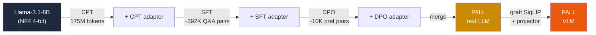

<div align="center">

# PALL

### Post-training Adaptation of LLMs at Low cost

**Turn Llama-3.1-8B into a dental specialist on a single A100 for ~\$20 — then make it see.**

[](https://huggingface.co/Harisundar/PALL-Text)
[](https://huggingface.co/Harisundar/PALL-VLM)
[](#license)
[](#the-efficiency-stack)
[](#the-efficiency-stack)

*Continued Pre-Training → Supervised Fine-Tuning → Direct Preference Optimization,
all under 4-bit QLoRA on one consumer-reachable GPU.*

[Quickstart](#quickstart) ·
[Pipeline](#the-pipeline) ·
[Efficiency](#the-efficiency-stack) ·
[Results](#results) ·
[Multimodal](#multimodal-extension) ·
[FAQ](#faq)

</div>

---

## Why PALL?

Frontier LLMs are still **clinically unsafe** on dental tasks (a 2026 multinational study found
a 31% unsafe-response rate), while specialized dental models are **locked behind multi-GPU
clusters and closed weights**. PALL closes that gap:

> **The contribution is not a new algorithm.** It is the *integration* of established
> parameter-efficient methods into one open, single-GPU, three-stage recipe — and its
> application to dentistry, including **preference tuning for safety**, which the dental-LLM
> literature otherwise lacks.

| | PALL | Typical dental LLM |
|---|:---:|:---:|
| Open weights | Yes | No (GPT-4o / closed) |
| Single GPU | Yes, A100-40GB | No, multi-GPU cluster |
| Cost | **~\$20** | hundreds of GPU-hours |
| Stages | CPT + SFT + **DPO** | usually SFT (or RAG) only |
| Safety alignment | Yes, DPO | No |

---

## The pipeline



| Stage | What it does | Data | Output | Docs |
|:-----:|--------------|------|--------|:----:|
| **1 · CPT** | inject dental knowledge | 175M-token corpus | domain-adapted base | [docs](training/CPT/README.md) |
| **2 · SFT** | teach instruction-following | ~392K Q&A pairs | task-competent model | [docs](training/SFT/README.md) |
| **3 · DPO** | align for safety & clarity | ~10K preference triplets | safe, hedged assistant | [docs](training/DPO/README.md) |

---

## The efficiency stack

Four established techniques, layered, are what make 8B training fit in 40 GB:

```
┌─────────────────────────────────────────────────────────────┐
│  QLoRA           base 16 GB → 4 GB   ·  168M trainable (2.1%) │
│  FlashAttention-2  attn 6.4 GB → 1 GB  (O(N²) → O(N))         │
│  Unsloth         fused kernels  ·  1.5–2× faster             │
│  Paged AdamW 8-bit  optimizer 2.7 GB → 0.34 GB, CPU-paged    │
└─────────────────────────────────────────────────────────────┘
            all in bf16 + gradient checkpointing
```

<details>
<summary><b>Memory budget per stage (40 GB A100)</b></summary>

| Stage | Base | LoRA+opt | Activations | Attn | Peak | Free |
|-------|------|----------|-------------|------|------|------|
| CPT (bs 32, grad-ckpt on) | 4.0 | 0.7 | 5.0 | 0.4 | ~12 GB | ~28 GB |
| SFT (bs 48, grad-ckpt off) | 4.0 | 0.7 | 24.0 | 1.0 | ~35 GB | ~5 GB |
| DPO (bs 16, grad-ckpt on) | 4.0 | 0.7 | 6.0 | 0.4 | ~15 GB | ~25 GB |

</details>

---

## Quickstart

```bash
# 1 · credentials  (fill in HF_TOKEN; judge API keys only needed for eval)
cp .env.example .env

# 2 · environment  (cloud GPU host — see training/setup_vast.sh for full Vast.ai bootstrap)
pip install -r training/requirements.txt        # Unsloth · TRL · PEFT · bitsandbytes

# 3 · train  (configs pull data straight from Harisundar/pall — no manual download)
python training/CPT/cpt_train.py --config training/CPT/cpt_config.yaml
python training/SFT/sft_train.py --config training/SFT/sft_v2_a100_config.yaml
python training/DPO/dpo_train.py --config training/DPO/dpo_v3_config.yaml
```

> Each trainer reads **all** hyperparameters from its YAML — no code edits needed to tune.
> Pass `--resume` to continue from the last checkpoint.

---

## Repository layout

```
PALL/
├── training/              # text pipeline (CPT → SFT → DPO)
│   ├── CPT/   cpt_train.py · cpt_config.yaml · README.md
│   ├── SFT/   sft_train.py · sft_*_config.yaml · run_sft_v2_a100.sh · README.md
│   ├── DPO/   dpo_train.py · dpo_*_config.yaml · dpo_pipeline.sh · vllm_generate_rejected.py · README.md
│   ├── callbacks.py        # shared: GPU/grad-norm/throughput/MCQ-eval callbacks
│   ├── prepare_data.py     # shared: build CPT/SFT/DPO datasets from sources
│   ├── setup_vast.sh       # cloud bootstrap (torch + flash-attn, correct order)
│   └── requirements.txt · APPROACH.md · TRAINING_OPTIMIZATION_REPORT.md
├── vlm/                   # multimodal extension (SigLIP + LLaVA graft)
│   └── build_model.py · data.py · train.py · eval.py · merge_lora.py · configs/ · README.md
├── data/                 # HF dataset references (no bulk data in git)
│   └── download.py · manifests/ · README.md
├── .env.example · .gitignore · requirements.txt · README.md
```

---

## Results

Held-out dental benchmark (250 MCQ · 250 oral-disease · 500 forum questions):

<div align="center">

| Stage | Dental MCQ | Trend |
|-------|:----------:|-------|
| Baseline Llama-3.1-8B | 56.0% | — |
| + CPT | 4.0% | format collapse (knowledge up, format down) |
| + SFT | **58.0%** | best MCQ — knowledge becomes accessible |
| + DPO | 48.8% | trades exam rigidity for conversation quality |

</div>

**Where DPO wins** (open-ended, the deployment-relevant axis):

| Metric (oral-disease) | SFT | DPO |
|---|:---:|:---:|
| Correctness | 3.78 | **4.61** |
| Clarity | 3.84 | **4.78** |
| Hedging (safety) | 4.82 | **4.97** |
| **Failure rate** | ~100% | **16%** |

> DPO sacrifices ~9 pts of strict MCQ accuracy to nearly **eliminate runaway generation and
> meta-narration** — the right trade for an interactive clinical assistant, not an exam-taker.

---

## Multimodal extension

The DPO'd text model is grafted into a **LLaVA-style VLM** — a frozen
`SigLIP-so400m-384` vision tower + 2-layer MLP projector + the dental LLM (LoRA r=16) —
trained on **32,884 records / 52,461 images** (oral-cancer photos & histopathology,
radiographs, ICDAS caries, Tufts, DENTEX, textbook figures).

- **Stage 1** — projector-only alignment (vision + LLM frozen)
- **Stage 2** — LoRA on LLM + projector (vision frozen)
- Guards against **modality collapse** with an image-shuffle control (accuracy *must* drop
  when images are randomized).

Full runbook: [`vlm/README.md`](vlm/README.md)

---

## On the Hub

| Artifact | Repo |
|---|---|
| Datasets (cpt/sft/dpo subsets) | [`Harisundar/pall`](https://huggingface.co/datasets/Harisundar/pall) *(private → public after deployment)* |
| Text model | [`Harisundar/PALL-Text`](https://huggingface.co/Harisundar/PALL-Text) — fully-merged dental Llama-3.1-8B (CPT+SFT+DPO) |
| VLM | [`Harisundar/PALL-VLM`](https://huggingface.co/Harisundar/PALL-VLM) — LLaVA-style dental vision-language model |

---

## FAQ

<details>
<summary><b>Is this just standard fine-tuning everyone already does?</b></summary>

The *techniques* (QLoRA, Unsloth, FA2, CPT→SFT→DPO) are well-known and widely used.
What's not done elsewhere is this **exact recipe applied to dentistry, released openly,
single-GPU, with safety-oriented DPO**. The closest prior multi-stage medical pipeline is
Hippocrates (general medicine); PALL is the dental, open, single-GPU instantiation.
</details>

<details>
<summary><b>Why does MCQ accuracy drop after DPO?</b></summary>

The preference data is entirely open-ended clinical interactions, so DPO rewards detailed
conversational answers over terse option-selection. Strict MCQ accuracy dips ~9 pts while
open-ended correctness/clarity/safety rise sharply — an intentional trade for the target
use case (interactive assistant).
</details>

<details>
<summary><b>Can I use this for a non-dental domain?</b></summary>

Yes — the pipeline is domain-agnostic. Swap the dataset (point each stage's YAML at your
own HF subset) and the CPT→SFT→DPO recipe transfers directly. A pip-installable CLI for
exactly this is on the roadmap (see below).
</details>

---

## Roadmap

- [ ] `pip install pall` — CLI wrapper: `pall train --stage cpt --config ...`
- [ ] Multimodal DPO (grounded-vs-hallucinated pairs, mDPO-style)
- [ ] Format-constrained DPO pairs to recover MCQ accuracy
- [ ] Retrieval-augmented grounding

---

## License

Apache-2.0 — consistent with the underlying Llama-3.1 and SigLIP licenses.

## Acknowledgement

Academic work (B.Tech, CSE-AIML). Builds on LoRA/QLoRA (Hu et al. 2022; Dettmers et al.
2023), DPO (Rafailov et al. 2023), FlashAttention-2, and Unsloth.

> **Disclaimer:** for research and clinical-decision-*support* only. Not for autonomous
> diagnosis or treatment.
